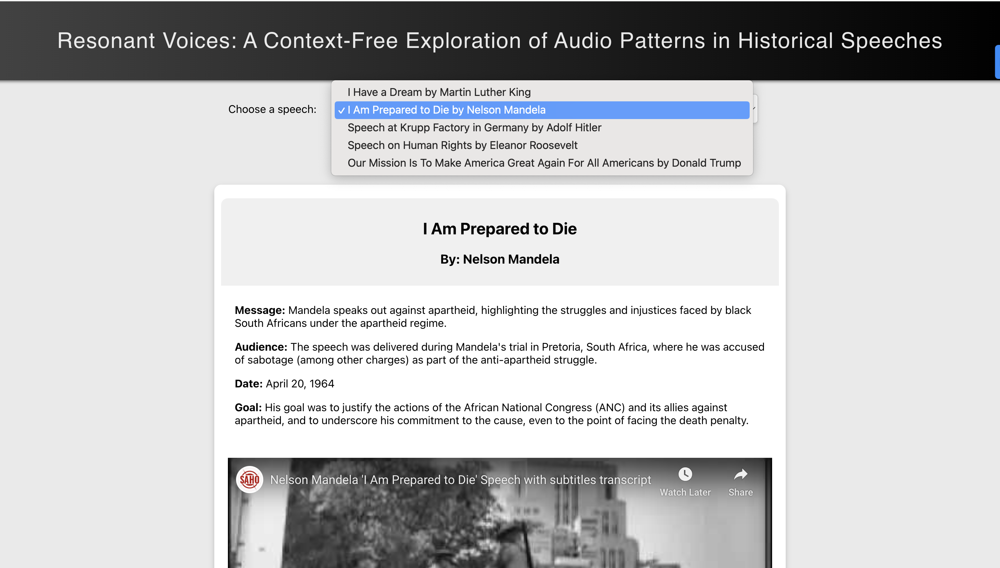

# Resonant Voices

Resonant Voices is a project developed for CS467 Social Visualization, exploring the impact of vocal delivery in public speeches through the analysis of audio patterns. Our team delved into famous historical and political speeches, examining how pitch, rate of speech, amplitude, and extracted emotions play a crucial role in audience engagement and message retention.

## Project Overview

What makes a speech impactful? While content and the social relevance of the speaker are paramount, the delivery of the speech—particularly the use of vocal tones—can significantly influence its reception. This project aims to highlight the critical balance between content and delivery, focusing on engagement through sound and learning speech patterns from the most influential figures in history.

## Motivation

Our research was driven by the following questions:

- What common audio patterns, such as pitch, rate of speech, amplitude, and extracted emotions, are present in influential historical and political speeches?
- How do these identified audio features and emotions inform us about the speaker's intent and the speech's impact on its audience?

## Data

We analyzed five publicly available speeches, each approximately five minutes long, including speeches by Adolf Hitler, Eleanor Roosevelt, Martin Luther King Jr., Nelson Mandela, and Donald Trump. These speeches were chosen for their historical and political significance and their availability in .wav format.

## Methodology

Our analysis utilized Python packages like `librosa` for extracting audio features and a pre-trained deep learning model for emotion prediction. We also employed ReactJs for the visualization component of the project.

## Findings

Our findings revealed that:

- Effective speeches use variations in pitch and energy to emphasize key points.
- The rate of speech and rhythm can significantly affect audience engagement.
- The speaker's intent, reflected through audio patterns, can motivate and mobilize the audience in diverse ways.

## Project Hosted URL

The project is hosted at: [https://my-speech-visualizer.web.app/](https://my-speech-visualizer.web.app/)

## Speech Processing Link

For a deeper dive into our speech processing methodology, visit our Colab notebook: [Google Colab Notebook](https://colab.research.google.com/drive/1qMy2Dn9N6lBvweNyd0U3v1CqVsIPHm8K?usp=sharing)

## Team Members

- Harshit
- Minrui
- Parisa
- Utkarsh
- Chenyao

## Acknowledgments

This project was inspired by the significant impact that vocal delivery has on the effectiveness of public speeches. We extend our gratitude to all contributors and resources that made this exploration possible.

## Interface Screenshots

*Speech Selection Interface*

*Audio Analysis Interface*

